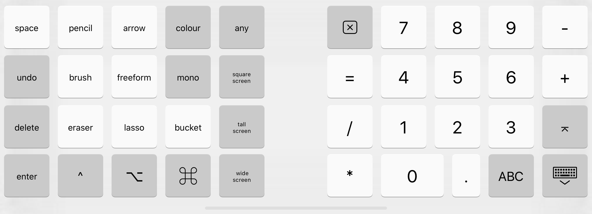

# artWORKS Keyboard
Custom keyboard for Deneba artWORKS and UltraPaint for use with both `Mini vMac` and `BasiliskII` emulators for iOS

- `keyboard-artworks.json` JSON definition
- `artWORKS.nfkeyboardlayout` compiled keyboard layout

## Changes from UK keyboard
- F1–F12 are relabelled and recoloured
- esc -> space
- pgup -> control
- pgdn -> option
- home -> command
- end -> remapped button
- help -> remapped button
- fwd del -> remapped button
- numpad replaced with labelled enter key
- control/option/command modifier keys are now momentary, not sticky

## Installation
- Put `artWORKS.nfkeyboardlayout` in the emulator's file sharing folder, inside the `Keybord Layouts` folder

## Screenshot

